# Memoria Explicativa Animación Vulkan

## Índice

- [body.skel](#bodyskel)
- [Info para testear](#info-para-testear)
- [Controles de la Aplicación](#controles-de-la-aplicación)
- [Descripción de la Animación](#descripción-de-la-animación)
  - [Detalles de los Keyframes](#detalles-de-los-keyframes)
  - [Fases del Movimiento](#fases-del-movimiento)
    - [Reposo](#reposo)
    - [Recepción](#recepción)
    - [Preparación](#preparación)
    - [Flexión](#flexión)
    - [Despegue](#despegue)
    - [Aire (Subida)](#aire-subida)
    - [Aire (Máximo)](#aire-máximo)
    - [Aire (Bajada)](#aire-bajada)
    - [Aterrizaje](#aterrizaje)
    - [Reposo final](#reposo-final)
  - [Animación completa](#animación-completa)
- [Clases Nuevas](#clases-nuevas)
  - [GESkeleton](#geskeleton)
    - [Archivo de Cabecera (GESkeleton.h)](#archivo-de-cabecera-geskeletonh)
    - [Implementación (GESkeleton.cpp)](#implementación-geskeletoncpp)
  - [GEAnimation](#geanimation)
    - [Archivo de Cabecera (GEAnimation.h)](#archivo-de-cabecera-geanimationh)
    - [Implementación (GEAnimation.cpp)](#implementación-geanimationcpp)
  - [GEXMLParser](#gexmlparser)
    - [Archivo de Cabecera (GEXMLParser.h)](#archivo-de-cabecera-gexmlparserh)
    - [Implementación (GEXMLParser.cpp)](#implementación-gexmlparsercpp)
- [Clases Modificadas](#clases-modificadas)
  - [GEBalljoint](#geballjoint)
    - [Cambios en el Archivo de Cabecera](#cambios-en-el-archivo-de-cabecera)
    - [Métodos Añadidos/Modificados en la Implementación](#métodos-añadidosmodificados-en-la-implementación)
  - [GEScene](#gescene)
    - [Cambios en el Archivo de Cabecera](#cambios-en-el-archivo-de-cabecera-1)
    - [Métodos Modificados en la Implementación](#métodos-modificados-en-la-implementación)

***

## body.skel

>[!Warning]
> El ejecutable del programa necesita tener el archivo .skel en su ubicación (`body.skel` / `bodyLimit.skel`)

En la clase GEXMLParser hacemos uso de la biblioteca [pugixml](https://pugixml.org). Facilita bastante el trabajo, permitiendo leer cualquier xml con el mismo formato sin tener que cambiar código.

El archivo `body.skel` no se ha modificado pero he creado una variante (`bodyLimit.skel`) con una etiquetea `<limits>` y dos hijas: `<min>` y `<max>` que, a su vez, tienen tres atributos cada una: `x`, `y` y `z`. Con estas nuevas etiquetas podemos establecer límites de rotación en los tres ejes en cada articulación.

El código está preparado para funcionar con el formato del `.skel` original y con el nuevo (con o sin límites). Para usar el `.skel` sin límites en articulaciones simplemente hay que cambiar el archivo en el método `GESkeleton::buildSkeleton`:

Cambiar

```cpp
void GESkeleton::buildSkeleton()
{
    GESkeletonData skelData;
    
    if (GEXMLParser::parseSkeletonFile("bodyLimit.skel", skelData)) {
    ...
}
```

por
```cpp
void GESkeleton::buildSkeleton()
{
    GESkeletonData skelData;
    
    if (GEXMLParser::parseSkeletonFile("body.skel", skelData)) {
    ...
}
```


## Info para testear

Para testear el código he dejado varias opciones deshabilitadas que me han ayudado a ir comprobando las rotaciones que he ido probando. Puede facilitar comprobar posiciones / rotaciones:

1. En DEBUG.h, descomentando la definición de la macro `#define DEBUG` podemos ver en terminal en tiempo de ejecución si algún ángulo establecio ha llegado al límite de rotación de alguna articulación. (Se muestra nombre articulación, grado introducido y el límite al que se ha establecido)

2. La animación puede pausarse en cualquier momento pulsando la tecla de espacio (para desplazar entre keyframes están las teclas `n` y `m`) pero, si quieres que al arrancar no empiece la animación automáticamente, puedes modificar el valor por defecto en el constructor de la clase GEAnimation:

    Cambiar
    ```cpp
    GEAnimation::GEAnimation(float duration, bool loop)
        : duration(duration), loop(loop), currentTime(0.0f), paused(false)
    {
    }
    ```

    por
    ```cpp
    GEAnimation::GEAnimation(float duration, bool loop)
        : duration(duration), loop(loop), currentTime(0.0f), paused(true)
    {
    }
    ```


## Controles de la Aplicación

| Tecla | Acción |
|-------|--------|
| `ESPACIO` | Pausar/Reproducir animación |
| `R` | Reiniciar animación |
| `M` | Siguiente keyframe |
| `N` | Anterior keyframe |
| Flechas | Control de cámara |
| `Q/A` | Subir/Bajar cámara |
| `O/P` | Mover cámara izquierda/derecha |
| `K/L` | Girar cámara izquierda/derecha |

## Descripción de la Animación

La animación que he implementado tiene una duración de **6 segundos** y se reproduce en bucle.

### Detalles de los Keyframes

Cada keyframe define:
1. **Tiempo**: Momento en segundos dentro de la animación
2. **Poses**: Mapa de articulación → rotaciones Euler (X, Y, Z) en grados
3. **Posición del esqueleto**: Coordenadas que posicionan al nodo raiz (pelvis) en el espacio 3D.

### Fases del Movimiento

La animación se divide en las siguientes fases:

| Fase | Tiempo | Descripción |
|------|--------|-------------|
| **Reposo** | 0.0s | Posición inicial de pie, brazos relajados a los lados |
| **Recepción** | 0.5s | Brazos un poco flexionados simulando recibir el balón, cabeza mirando hacia el balón |
| **Preparación** | 1.0s | Transición con codos flexionados, preparando el tiro |
| **Flexión** | 2.0s | Máxima flexión de rodillas, cuerpo agachado, brazos recogidos. El esqueleto baja (Y=0.85) para "mantener" los pies en el suelo|
| **Despegue** | 2.5s | Inicio del salto, piernas empezando a extenderse |
| **Aire (subida)** | 2.9s | En el aire subiendo, piernas extendidas con pies en punta |
| **Aire (máximo)** | 3.2s | Punto más alto del salto (Y=2.0), brazos extendidos hacia arriba (lanzamiento) |
| **Aire (bajada)** | 3.6s | Descendiendo, brazos relajándose tras el lanzamiento |
| **Aterrizaje** | 4.0s | Contacto con el suelo, flexionar rodillas y brazos relajados |
| **Reposo final** | 5.0s | Vuelta a la posición inicial |

#### Reposo

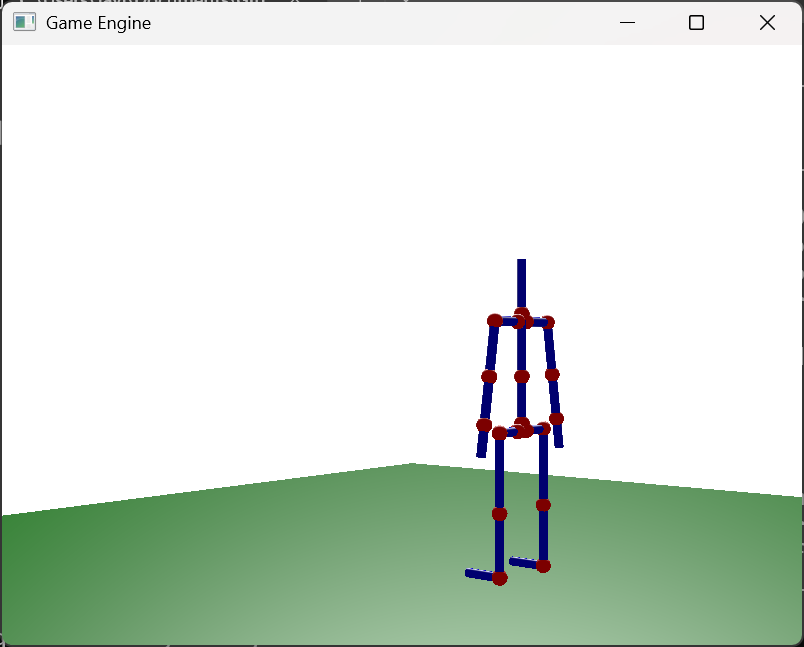


#### Recepción

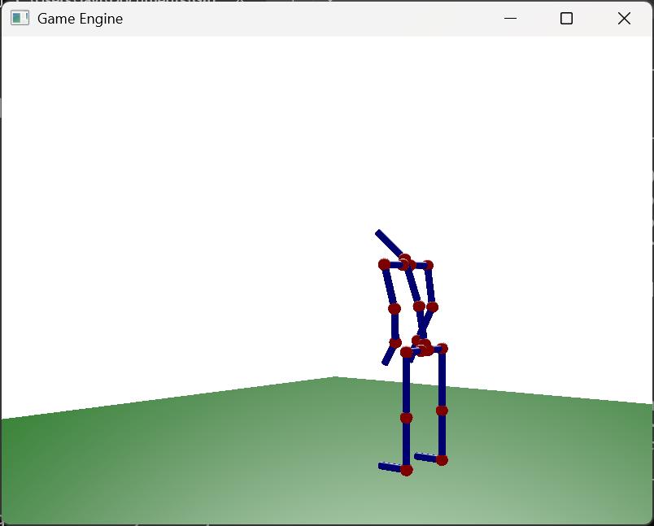


#### Preparación

Este keyframe lo añadí porque la interpolación entre el keyframe anterior y el siguiente no se visualizaba bien (chocaban las manos).

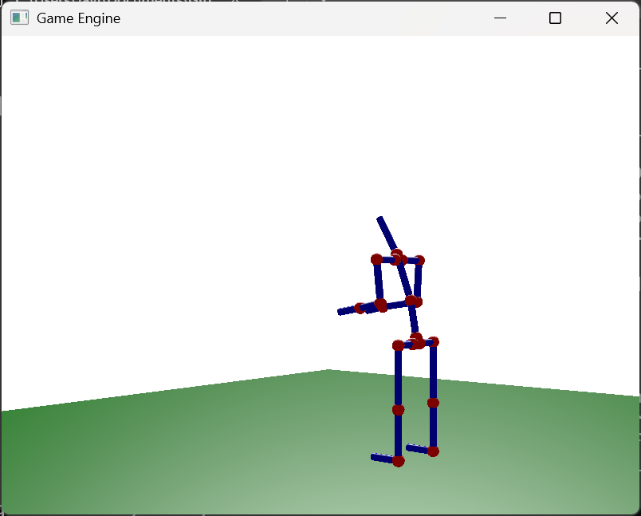


#### Flexión

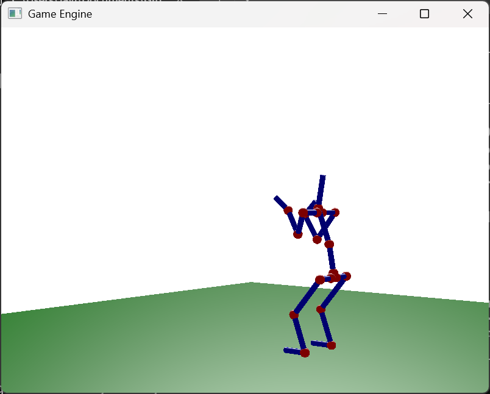
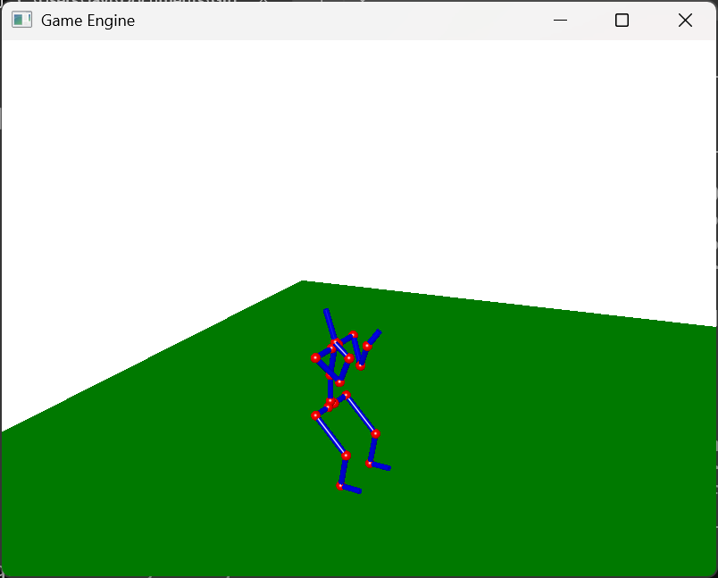

#### Despegue

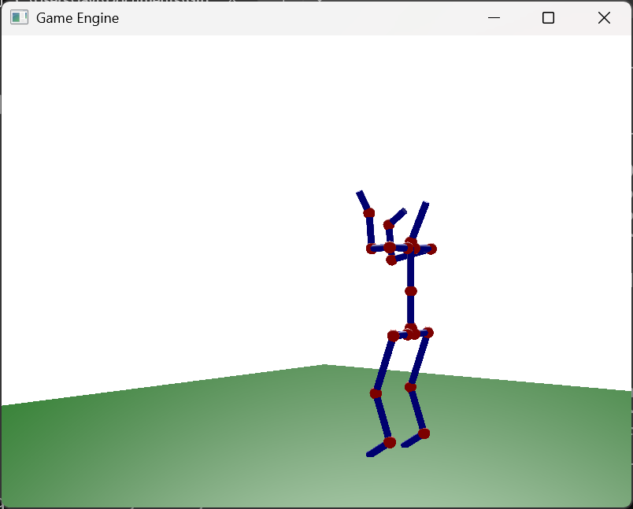


#### Aire (Subida)

Este también lo añadí después porque el movimiento no se veía natural, al interpolar parecía que primero extendía las piernas y luego empezaba a flotar.

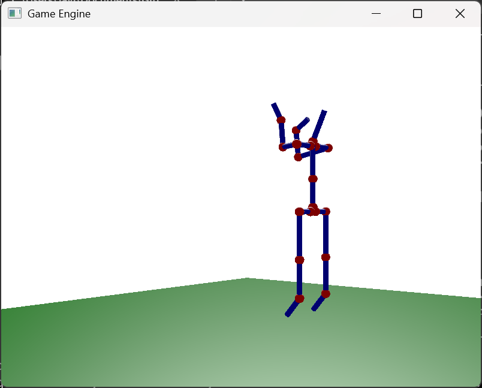
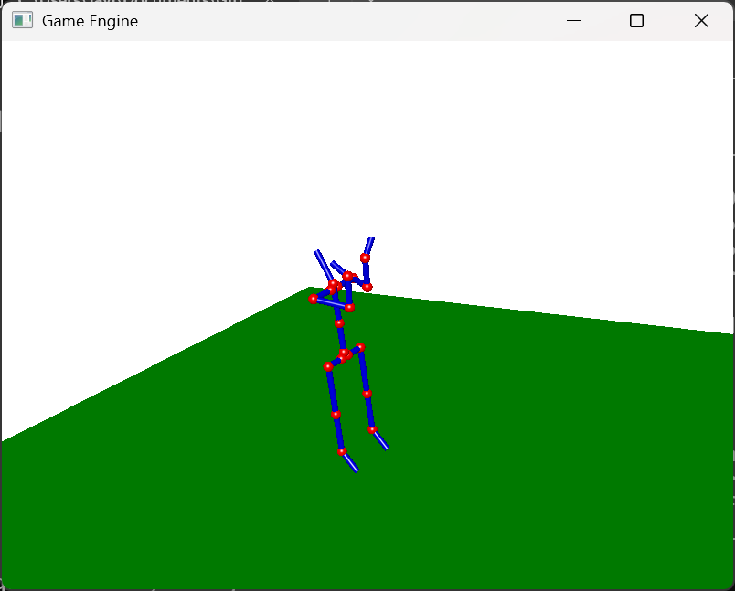

#### Aire (Máximo)

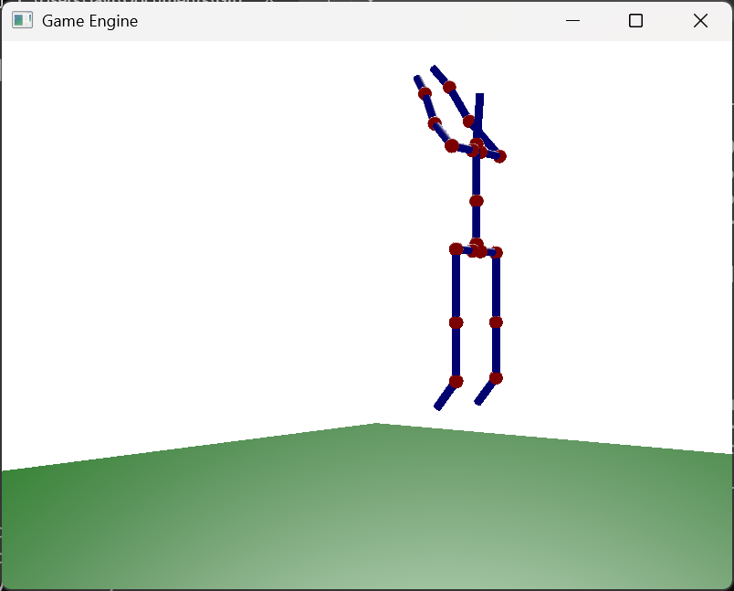
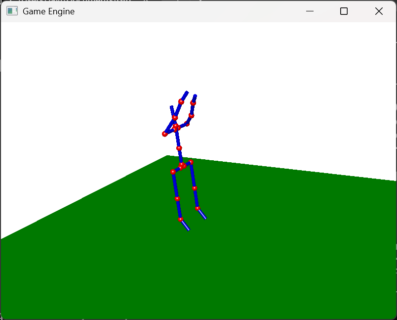

#### Aire (Bajada)

Este keyframe también lo añadí después porque al interpolar parecía que aterrizara en el aire entonces, simplemente dupliqué el keyframe anterior bajándole un poco los brazos y la posición global en el eje Y.

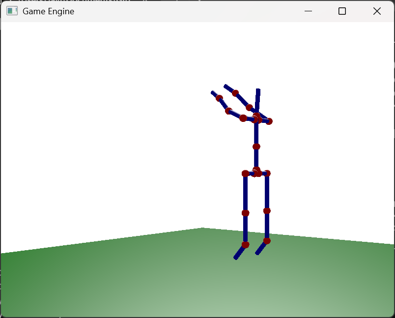


#### Aterrizaje

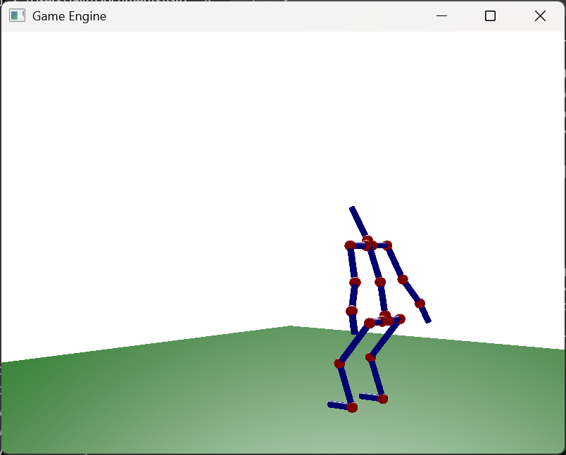


#### Reposo final

Mismo keyframe que el inicial para que se produzca interpolación y se vea un bucle perfecto

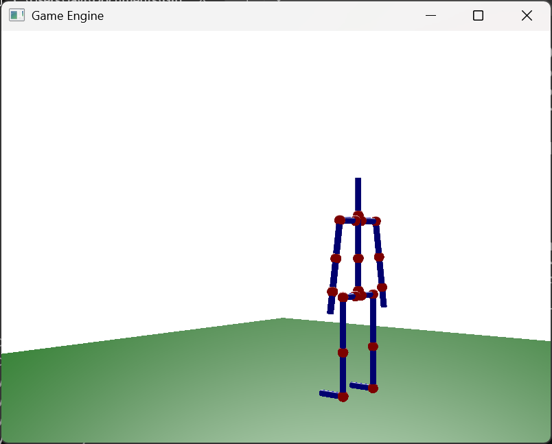


### Animación completa

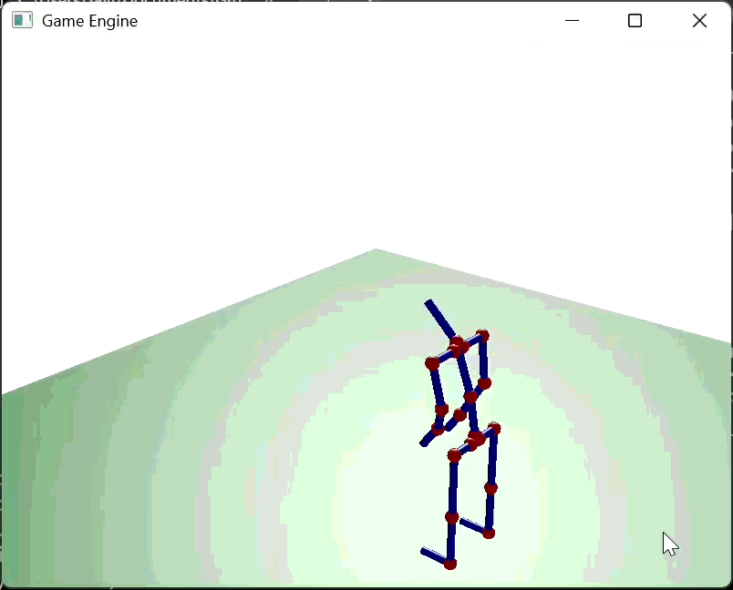


***


## Clases Nuevas

### GESkeleton

Esta clase representa un esqueleto completo con articulaciones jerárquicas. Almacena toda la información del esqueleto cargada desde un archivo `.skel` en formato XML.

#### Archivo de Cabecera (GESkeleton.h)

```cpp
/**
 * @file GESkeleton.h
 * @brief Declaración de la clase GESkeleton que representa un esqueleto con articulaciones jerárquicas.
 */

#pragma once

#include "GEGraphicsContext.h"
#include "GERenderingContext.h"
#include "GEBalljoint.h"
#include "GEXMLParser.h"
#include "GELight.h"
#include <glm/glm.hpp>
#include <string>

/**
 * @class GESkeleton
 * @brief Representa un esqueleto completo con articulaciones jerárquicas.
 */
class GESkeleton {
private:
    std::string name; ///< Nombre del esqueleto.
    glm::vec3 position; ///< Posición global del esqueleto.
    glm::vec3 zAxis; ///< Eje Z local.
    glm::vec3 yAxis; ///< Eje Y local.
    std::vector<GEBalljoint*> rootJoints; ///< Articulaciones raíz del esqueleto.
    
    /**
     * @brief Construye la jerarquía de articulaciones desde body.skel.
     */
    void buildSkeleton();
    
    /**
     * @brief Crea recursivamente las articulaciones desde los datos parseados.
     * @param data Datos de la articulación.
     * @return Puntero a la articulación creada.
     */
    GEBalljoint* createJointFromData(const GEJointData& data);

public:
    GESkeleton();
    ~GESkeleton();
    
    void initialize(GEGraphicsContext* gc, GERenderingContext* rc);
    void destroy(GEGraphicsContext* gc);
    void update(GEGraphicsContext* gc, uint32_t index, glm::mat4 view, glm::mat4 projection);
    void addCommands(VkCommandBuffer commandBuffer, VkPipelineLayout pipelineLayout, int index);
    void setLight(GELight light);
    
    // Acceso a articulaciones
    GEBalljoint* findJoint(const std::string& jointName);
    GEBalljoint* getRoot() const;
    const std::vector<GEBalljoint*>& getRootJoints() const;
    
    // Getters/Setters
    void setPosition(glm::vec3 pos);
    glm::vec3 getPosition() const;
    void setOrientation(glm::vec3 z, glm::vec3 y);
};
```

#### Implementación (GESkeleton.cpp)

```cpp
/**
 * @file GESkeleton.cpp
 * @brief Implementación de GESkeleton con carga desde archivo .skel.
 */

#include "GESkeleton.h"
#include <glm/gtc/matrix_transform.hpp>
#include <iostream>

/**
 * @brief Constructor del esqueleto.
 */
GESkeleton::GESkeleton()
{
    name = "body";
    position = glm::vec3(0.0f, 0.0f, 0.0f);
    zAxis = glm::vec3(0.0f, 0.0f, 1.0f);
    yAxis = glm::vec3(0.0f, 1.0f, 0.0f);
    
    buildSkeleton();
}

/**
 * @brief Destructor.
 */
GESkeleton::~GESkeleton()
{
    // La destrucción de joints se hace en destroy()
}

/**
 * @brief Crea recursivamente las articulaciones desde los datos parseados.
 * @param data Datos de la articulación.
 * @return Puntero a la articulación creada.
 */
GEBalljoint* GESkeleton::createJointFromData(const GEJointData& data)
{
    GEBalljoint* joint = new GEBalljoint(data.name, data.length, 
                                          data.offset, data.zAxis, data.yAxis);
    
    // Aplicar límites si están definidos
    if (data.hasLimits) {
        joint->setLimits(data.limitsMin, data.limitsMax);
    }
    
    // Crear hijos recursivamente
    for (const GEJointData& childData : data.children) {
        GEBalljoint* child = createJointFromData(childData);
        joint->addChild(child);
    }
    
    return joint;
}

/**
 * @brief Construye el árbol de articulaciones desde body.skel.
 */
void GESkeleton::buildSkeleton()
{
    GESkeletonData skelData;
    
    if (GEXMLParser::parseSkeletonFile("bodyLimit.skel", skelData)) {
        name = skelData.name;
        zAxis = skelData.zAxis;
        yAxis = skelData.yAxis;
        position = skelData.offset;
        
        // Crear todas las articulaciones raíz
        for (const GEJointData& jointData : skelData.rootJoints) {
            GEBalljoint* rootJoint = createJointFromData(jointData);
            rootJoints.push_back(rootJoint);
        }
        
        std::cout << "Esqueleto cargado desde body.skel con " 
                  << rootJoints.size() << " articulaciones raiz." << std::endl;
    } else {
        std::cerr << "Error: No se pudo cargar body.skel" << std::endl;
    }
}

/**
 * @brief Inicializa el esqueleto.
 */
void GESkeleton::initialize(GEGraphicsContext* gc, GERenderingContext* rc)
{
    for (GEBalljoint* root : rootJoints) {
        root->initializeRecursive(gc, rc);
    }
}

/**
 * @brief Destruye el esqueleto.
 */
void GESkeleton::destroy(GEGraphicsContext* gc)
{
    for (GEBalljoint* root : rootJoints) {
        root->destroyRecursive(gc);
        delete root;
    }
    rootJoints.clear();
}

/**
 * @brief Actualiza el esqueleto.
 */
void GESkeleton::update(GEGraphicsContext* gc, uint32_t index, glm::mat4 view, glm::mat4 projection)
{
    // Matriz base: traslación + orientación del esqueleto
    glm::mat4 baseMatrix = glm::translate(glm::mat4(1.0f), position);
    
    for (GEBalljoint* root : rootJoints) {
        root->updateRecursive(gc, index, baseMatrix, view, projection);
    }
}

/**
 * @brief Añade comandos de dibujo.
 */
void GESkeleton::addCommands(VkCommandBuffer commandBuffer, VkPipelineLayout pipelineLayout, int index)
{
    for (GEBalljoint* root : rootJoints) {
        root->addCommandsRecursive(commandBuffer, pipelineLayout, index);
    }
}

/**
 * @brief Asigna la luz al esqueleto.
 */
void GESkeleton::setLight(GELight light)
{
    for (GEBalljoint* root : rootJoints) {
        root->setLightRecursive(light);
    }
}

/**
 * @brief Busca una articulación por nombre.
 */
GEBalljoint* GESkeleton::findJoint(const std::string& jointName)
{
    for (GEBalljoint* root : rootJoints) {
        GEBalljoint* found = root->findChild(jointName);
        if (found != nullptr) {
            return found;
        }
    }
    return nullptr;
}

/**
 * @brief Obtiene la primera articulación raíz.
 */
GEBalljoint* GESkeleton::getRoot() const
{
    return rootJoints.empty() ? nullptr : rootJoints[0];
}

/**
 * @brief Obtiene todas las articulaciones raíz.
 */
const std::vector<GEBalljoint*>& GESkeleton::getRootJoints() const
{
    return rootJoints;
}

/**
 * @brief Asigna la posición del esqueleto.
 */
void GESkeleton::setPosition(glm::vec3 pos)
{
    position = pos;
}

/**
 * @brief Obtiene la posición del esqueleto.
 */
glm::vec3 GESkeleton::getPosition() const
{
    return position;
}

/**
 * @brief Asigna la orientación del esqueleto.
 */
void GESkeleton::setOrientation(glm::vec3 z, glm::vec3 y)
{
    zAxis = z;
    yAxis = y;
}
```


### GEAnimation

Esta clase es responsable de gestionar la animación del esqueleto mediante un sistema de keyframes con interpolación lineal.

#### Archivo de Cabecera (GEAnimation.h)

```cpp
/**
 * @file GEAnimation.h
 * @brief Declaración de la clase GEAnimation para sistema de animación por keyframes.
 */

#pragma once

#include <glm/glm.hpp>
#include <string>
#include <map>
#include <vector>

class GESkeleton;

/**
 * @struct Keyframe
 * @brief Representa un fotograma clave de la animación.
 */
struct Keyframe {
    float time;  ///< Tiempo del keyframe.
    std::map<std::string, glm::vec3> poses;  ///< Mapa de poses: nombre -> (angleX, angleY, angleZ)
    glm::vec3 skeletonPosition;  ///< Posición del esqueleto (para el salto).
};

/**
 * @class GEAnimation
 * @brief Sistema de animación por keyframes con interpolación lineal.
 */
class GEAnimation {
private:
    std::vector<Keyframe> keyframes;
    float duration;
    float currentTime;
    bool loop;
    bool paused;

public:
    GEAnimation(float duration, bool loop = true);
    
    void addKeyframe(float time, const std::map<std::string, glm::vec3>& poses,
                     glm::vec3 skeletonPos = glm::vec3(0.0f));
    void update(float deltaTime);
    void reset();
    void pause();
    void resume();
    void togglePause();
    
    glm::vec3 getPoseAt(const std::string& jointName) const;
    glm::vec3 getSkeletonPosition() const;
    void applyToSkeleton(GESkeleton* skeleton);
    
    float getCurrentTime() const;
    float getDuration() const;
    int getCurrentKeyframeIndex() const;
    int getKeyframeCount() const;
    bool isPaused() const;
    
    void nextKeyframe();
    void prevKeyframe();
};
```

#### Implementación (GEAnimation.cpp)

```cpp
/**
 * @file GEAnimation.cpp
 * @brief Implementación del sistema de animación por keyframes.
 */

#include "GEAnimation.h"
#include "GESkeleton.h"
#include "GEBalljoint.h"

/**
 * @brief Constructor de la animación.
 */
GEAnimation::GEAnimation(float duration, bool loop)
    : duration(duration), loop(loop), currentTime(0.0f), paused(true)
{
}

/**
 * @brief Añade un keyframe a la animación.
 */
void GEAnimation::addKeyframe(float time, const std::map<std::string, glm::vec3>& poses,
                               glm::vec3 skeletonPos)
{
    Keyframe kf;
    kf.time = time;
    kf.poses = poses;
    kf.skeletonPosition = skeletonPos;
    
    // Insertar ordenado por tiempo
    auto it = keyframes.begin();
    while (it != keyframes.end() && it->time < time) {
        ++it;
    }
    keyframes.insert(it, kf);
}

/**
 * @brief Actualiza el tiempo de la animación.
 */
void GEAnimation::update(float deltaTime)
{
    if (paused || keyframes.empty()) return;
    
    currentTime += deltaTime;
    
    if (currentTime >= duration) {
        if (loop) {
            currentTime = fmod(currentTime, duration);
        } else {
            currentTime = duration;
            paused = true;
        }
    }
}

/**
 * @brief Reinicia la animación.
 */
void GEAnimation::reset()
{
    currentTime = 0.0f;
    paused = false;
}

void GEAnimation::pause() { paused = true; }
void GEAnimation::resume() { paused = false; }
void GEAnimation::togglePause() { paused = !paused; }

/**
 * @brief Obtiene la pose interpolada para una articulación.
 * @param jointName Nombre de la articulación.
 * @return Vector con las rotaciones X, Y, Z interpoladas.
 */
glm::vec3 GEAnimation::getPoseAt(const std::string& jointName) const
{
    if (keyframes.empty()) return glm::vec3(0.0f);
    
    // Encontrar keyframes anterior y siguiente
    const Keyframe* prev = &keyframes[0];
    const Keyframe* next = &keyframes[0];
    
    for (size_t i = 0; i < keyframes.size(); i++) {
        if (keyframes[i].time <= currentTime) {
            prev = &keyframes[i];
        }
        if (keyframes[i].time >= currentTime) {
            next = &keyframes[i];
            break;
        }
    }
    
    // Obtener poses
    glm::vec3 prevPose(0.0f);
    glm::vec3 nextPose(0.0f);
    
    auto it = prev->poses.find(jointName);
    if (it != prev->poses.end()) {
        prevPose = it->second;
    }
    
    it = next->poses.find(jointName);
    if (it != next->poses.end()) {
        nextPose = it->second;
    }
    
    // Interpolar linealmente
    if (prev == next || prev->time == next->time) {
        return prevPose;
    }
    
    float t = (currentTime - prev->time) / (next->time - prev->time);
    return glm::mix(prevPose, nextPose, t);
}

/**
 * @brief Obtiene la posición del esqueleto interpolada (para el salto).
 */
glm::vec3 GEAnimation::getSkeletonPosition() const
{
    if (keyframes.empty()) return glm::vec3(0.0f);
    
    const Keyframe* prev = &keyframes[0];
    const Keyframe* next = &keyframes[0];
    
    for (size_t i = 0; i < keyframes.size(); i++) {
        if (keyframes[i].time <= currentTime) {
            prev = &keyframes[i];
        }
        if (keyframes[i].time >= currentTime) {
            next = &keyframes[i];
            break;
        }
    }
    
    if (prev == next || prev->time == next->time) {
        return prev->skeletonPosition;
    }
    
    float t = (currentTime - prev->time) / (next->time - prev->time);
    return glm::mix(prev->skeletonPosition, next->skeletonPosition, t);
}

/**
 * @brief Aplica la animación actual al esqueleto.
 */
void GEAnimation::applyToSkeleton(GESkeleton* skeleton)
{
    if (!skeleton) return;
    
    // Aplicar posición del esqueleto (para salto)
    skeleton->setPosition(getSkeletonPosition());
    
    // Lista de articulaciones a animar
    const char* jointNames[] = {
        "pelvis", "spine", "neck",
        "clavicle_l", "shoulder_l", "elbow_l", "wrist_l",
        "clavicle_r", "shoulder_r", "elbow_r", "wrist_r",
        "hip_l", "leg_l", "knee_l", "ankle_l",
        "hip_r", "leg_r", "knee_r", "ankle_r"
    };
    
    for (const char* name : jointNames) {
        GEBalljoint* joint = skeleton->findJoint(name);
        if (joint) {
            glm::vec3 pose = getPoseAt(name);
            joint->setPose(pose.x, pose.y, pose.z);
        }
    }
}

float GEAnimation::getCurrentTime() const { return currentTime; }
float GEAnimation::getDuration() const { return duration; }
bool GEAnimation::isPaused() const { return paused; }

int GEAnimation::getCurrentKeyframeIndex() const
{
    for (size_t i = 0; i < keyframes.size(); i++) {
        if (keyframes[i].time >= currentTime) {
            return (int)i;
        }
    }
    return (int)keyframes.size() - 1;
}

int GEAnimation::getKeyframeCount() const { return (int)keyframes.size(); }

void GEAnimation::nextKeyframe()
{
    if (keyframes.empty()) return;
    
    for (size_t i = 0; i < keyframes.size(); i++) {
        if (keyframes[i].time > currentTime + 0.01f) {
            currentTime = keyframes[i].time;
            return;
        }
    }
    currentTime = keyframes[0].time;
}

void GEAnimation::prevKeyframe()
{
    if (keyframes.empty()) return;
    
    for (int i = (int)keyframes.size() - 1; i >= 0; i--) {
        if (keyframes[i].time < currentTime - 0.01f) {
            currentTime = keyframes[i].time;
            return;
        }
    }
    currentTime = keyframes.back().time;
}
```


### GEXMLParser

Esta clase auxiliar permite cargar la definición del esqueleto desde archivos XML (`.skel`), utilizando la biblioteca pugixml.

#### Archivo de Cabecera (GEXMLParser.h)

```cpp
/**
 * @file GEXMLParser.h
 * @brief Parser para archivos .skel (XML) usando pugixml.
 */

#pragma once

#include <string>
#include <vector>
#include <glm/glm.hpp>
#include "pugixml/pugixml.hpp"

/**
 * @struct GEJointData
 * @brief Estructura para almacenar los datos de una articulación parseada.
 */
struct GEJointData {
    std::string name;                   ///< Nombre de la articulación.
    float length;                       ///< Longitud del hueso.
    glm::vec3 offset;                   ///< Desplazamiento local respecto al padre.
    glm::vec3 zAxis;                    ///< Eje Z local (dirección del hueso).
    glm::vec3 yAxis;                    ///< Eje Y local (orientación "arriba").
    glm::vec3 limitsMin;                ///< Límites mínimos de rotación (grados).
    glm::vec3 limitsMax;                ///< Límites máximos de rotación (grados).
    bool hasLimits;                     ///< Indica si tiene límites definidos.
    std::vector<GEJointData> children;  ///< Articulaciones hijas.
};

/**
 * @struct GESkeletonData
 * @brief Estructura para almacenar los datos completos del esqueleto.
 */
struct GESkeletonData {
    std::string name;                   ///< Nombre del esqueleto.
    glm::vec3 offset;                   ///< Offset global del esqueleto.
    glm::vec3 zAxis;                    ///< Eje Z del esqueleto.
    glm::vec3 yAxis;                    ///< Eje Y del esqueleto.
    std::vector<GEJointData> rootJoints;///< Articulaciones raíz.
};

/**
 * @class GEXMLParser
 * @brief Parser para archivos .skel en formato XML usando pugixml.
 */
class GEXMLParser {
public:
    static bool parseSkeletonFile(const std::string& filename, GESkeletonData& outData);

private:
    static glm::vec3 parseVec3(pugi::xml_node node);
    static GEJointData parseBalljoint(pugi::xml_node node);
};
```

#### Implementación (GEXMLParser.cpp)

```cpp
/**
 * @file GEXMLParser.cpp
 * @brief Implementación del parser XML usando pugixml.
 */

#include "GEXMLParser.h"
#include <iostream>

/**
 * @brief Parsea un nodo vec3 con atributos x, y, z.
 */
glm::vec3 GEXMLParser::parseVec3(pugi::xml_node node) {
    return glm::vec3(
        node.attribute("x").as_float(0.0f),
        node.attribute("y").as_float(0.0f),
        node.attribute("z").as_float(0.0f)
    );
}

/**
 * @brief Parsea una articulación y sus hijas recursivamente.
 */
GEJointData GEXMLParser::parseBalljoint(pugi::xml_node node) {
    GEJointData joint;
    
    joint.name = node.attribute("name").as_string("");
    joint.length = node.attribute("length").as_float(0.0f);
    
    // Valores por defecto
    joint.offset = glm::vec3(0.0f);
    joint.zAxis = glm::vec3(0.0f, 0.0f, 1.0f);
    joint.yAxis = glm::vec3(0.0f, 1.0f, 0.0f);
    joint.limitsMin = glm::vec3(-180.0f);
    joint.limitsMax = glm::vec3(180.0f);
    joint.hasLimits = false;
    
    // Parsear offset
    pugi::xml_node offsetNode = node.child("offset");
    if (offsetNode) {
        joint.offset = parseVec3(offsetNode);
    }
    
    // Parsear zaxis
    pugi::xml_node zaxisNode = node.child("zaxis");
    if (zaxisNode) {
        joint.zAxis = parseVec3(zaxisNode);
    }
    
    // Parsear yaxis
    pugi::xml_node yaxisNode = node.child("yaxis");
    if (yaxisNode) {
        joint.yAxis = parseVec3(yaxisNode);
    }
    
    // Parsear límites (opcional)
    pugi::xml_node limitsNode = node.child("limits");
    if (limitsNode) {
        joint.hasLimits = true;
        pugi::xml_node minNode = limitsNode.child("min");
        pugi::xml_node maxNode = limitsNode.child("max");
        if (minNode) {
            joint.limitsMin = parseVec3(minNode);
        }
        if (maxNode) {
            joint.limitsMax = parseVec3(maxNode);
        }
    }
    
    // Parsear hijos recursivamente
    for (pugi::xml_node child : node.children("balljoint")) {
        joint.children.push_back(parseBalljoint(child));
    }
    
    return joint;
}

/**
 * @brief Parsea un archivo .skel y devuelve los datos del esqueleto.
 */
bool GEXMLParser::parseSkeletonFile(const std::string& filename, GESkeletonData& outData) {
    pugi::xml_document doc;
    pugi::xml_parse_result result = doc.load_file(filename.c_str());
    
    if (!result) {
        std::cerr << "Error al cargar " << filename << ": " << result.description() << std::endl;
        return false;
    }
    
    pugi::xml_node skeleton = doc.child("skeleton");
    if (!skeleton) {
        std::cerr << "Error: No se encontró el elemento <skeleton>" << std::endl;
        return false;
    }
    
    outData.name = skeleton.attribute("name").as_string("skeleton");
    outData.offset = glm::vec3(0.0f);
    outData.zAxis = glm::vec3(0.0f, 0.0f, 1.0f);
    outData.yAxis = glm::vec3(0.0f, 1.0f, 0.0f);
    
    // Parsear offset del esqueleto
    pugi::xml_node offsetNode = skeleton.child("offset");
    if (offsetNode) {
        outData.offset = parseVec3(offsetNode);
    }
    
    // Parsear ejes del esqueleto
    pugi::xml_node zaxisNode = skeleton.child("zaxis");
    if (zaxisNode) {
        outData.zAxis = parseVec3(zaxisNode);
    }
    
    pugi::xml_node yaxisNode = skeleton.child("yaxis");
    if (yaxisNode) {
        outData.yAxis = parseVec3(yaxisNode);
    }
    
    // Parsear articulaciones raíz
    outData.rootJoints.clear();
    for (pugi::xml_node joint : skeleton.children("balljoint")) {
        outData.rootJoints.push_back(parseBalljoint(joint));
    }
    
    std::cout << "Esqueleto '" << outData.name << "' cargado con " 
              << outData.rootJoints.size() << " articulaciones raiz" << std::endl;
    
    return true;
}
```


## Clases Modificadas

### GEBalljoint

La clase `GEBalljoint` ha sido ampliamente modificada para soportar jerarquías de articulaciones, límites de rotación y métodos recursivos.

#### Cambios en el Archivo de Cabecera

**Versión Original (Práctica 7):**
```cpp
class GEBalljoint {
private:
    GLfloat length;
    glm::vec3 location;
    glm::vec3 dir;
    glm::vec3 up;
    glm::vec3 right;
    GLfloat angles[3];
    GESphere* joint;
    GECylinder* bone;
    void ComputeMatrix();

public:
    GEBalljoint(float length);
    void initialize(GEGraphicsContext* gc, GERenderingContext* rc);
    void destroy(GEGraphicsContext* gc);
    void addCommands(VkCommandBuffer commandBuffer, VkPipelineLayout pipelineLayout, int index);
    void update(GEGraphicsContext* gc, uint32_t index, glm::mat4 view, glm::mat4 projection);
    void setLight(GELight l);
    void setLocation(glm::vec3 loc);
    void setOrientation(glm::vec3 nDir, glm::vec3 nUp);
    void setPose(float xrot, float yrot, float zrot);
};
```

**Versión Modificada:**
```cpp
class GEBalljoint
{
private:
    // Propiedades básicas (existentes)
    GLfloat length;
    glm::vec3 location;
    glm::vec3 dir;
    glm::vec3 up;
    glm::vec3 right;
    GLfloat angles[3];
    GESphere *joint;
    GECylinder *bone;

    // NUEVAS propiedades para jerarquía
    std::string name;
    glm::vec3 offset;
    glm::vec3 localZAxis;
    glm::vec3 localYAxis;
    std::vector<GEBalljoint *> children;
    glm::mat4 worldMatrix;

    // NUEVA estructura para límites de rotación
    struct Limits
    {
        glm::vec3 min;
        glm::vec3 max;
        bool enabled;
    } limits;

    void ComputeMatrix();
    void ComputeMatrix(glm::mat4 parentMatrix);  // NUEVO método sobrecargado

public:
    GEBalljoint(float length);
    
    // NUEVO constructor jerárquico
    GEBalljoint(const std::string &name, float length,
                glm::vec3 offset, glm::vec3 zAxis, glm::vec3 yAxis);

    // Métodos existentes
    void initialize(GEGraphicsContext *gc, GERenderingContext *rc);
    void destroy(GEGraphicsContext *gc);
    void addCommands(VkCommandBuffer commandBuffer, VkPipelineLayout pipelineLayout, int index);
    void update(GEGraphicsContext *gc, uint32_t index, glm::mat4 view, glm::mat4 projection);

    // NUEVOS métodos recursivos
    void initializeRecursive(GEGraphicsContext *gc, GERenderingContext *rc);
    void destroyRecursive(GEGraphicsContext *gc);
    void addCommandsRecursive(VkCommandBuffer commandBuffer, VkPipelineLayout pipelineLayout, int index);
    void updateRecursive(GEGraphicsContext *gc, uint32_t index,
                         glm::mat4 parentMatrix, glm::mat4 view, glm::mat4 projection);
    void setLightRecursive(GELight l);

    // Setters existentes
    void setLight(GELight l);
    void setLocation(glm::vec3 loc);
    void setOrientation(glm::vec3 nDir, glm::vec3 nUp);
    void setPose(float xrot, float yrot, float zrot);  // Modificado para respetar límites
    
    // NUEVOS setters
    void setLimits(glm::vec3 min, glm::vec3 max);

    // NUEVOS métodos para jerarquía
    void addChild(GEBalljoint *child);
    GEBalljoint *findChild(const std::string &searchName);

    // NUEVOS getters
    const std::string &getName() const;
    const std::vector<GEBalljoint *> &getChildren() const;
    glm::mat4 getWorldMatrix() const;
    glm::mat4 getBoneEndMatrix() const;
};
```

#### Métodos Añadidos/Modificados en la Implementación

**Constructor jerárquico (NUEVO):**
```cpp
GEBalljoint::GEBalljoint(const std::string &name, float length,
                         glm::vec3 offset, glm::vec3 zAxis, glm::vec3 yAxis)
{
    this->name = name;
    this->length = length;
    this->offset = offset;
    this->localZAxis = zAxis;
    this->localYAxis = yAxis;

    glm::vec3 xAxis = glm::cross(yAxis, zAxis);
    this->dir = zAxis;
    this->up = yAxis;
    this->right = xAxis;
    this->location = glm::vec3(0.0f);

    angles[0] = 0.0f;
    angles[1] = 0.0f;
    angles[2] = 0.0f;

    joint = nullptr;
    bone = nullptr;
    worldMatrix = glm::mat4(1.0f);

    limits.enabled = false;
    limits.min = glm::vec3(-180.0f);
    limits.max = glm::vec3(180.0f);
}
```

**ComputeMatrix con matriz padre (NUEVO):**
```cpp
void GEBalljoint::ComputeMatrix(glm::mat4 parentMatrix)
{
    // Matriz de orientación local
    glm::vec3 xAxis = glm::cross(localYAxis, localZAxis);

    glm::mat4 orientationMatrix;
    orientationMatrix[0] = glm::vec4(xAxis, 0.0f);
    orientationMatrix[1] = glm::vec4(localYAxis, 0.0f);
    orientationMatrix[2] = glm::vec4(localZAxis, 0.0f);
    orientationMatrix[3] = glm::vec4(offset, 1.0f);

    // Matriz de pose (rotaciones Euler ZYX)
    float cx = cos(glm::radians(angles[0]));
    float sx = sin(glm::radians(angles[0]));
    float cy = cos(glm::radians(angles[1]));
    float sy = sin(glm::radians(angles[1]));
    float cz = cos(glm::radians(angles[2]));
    float sz = sin(glm::radians(angles[2]));

    glm::mat4 poseMatrix;
    poseMatrix[0][0] = cz * cy;
    poseMatrix[1][0] = -sz * cx + cz * sy * sx;
    poseMatrix[2][0] = sz * sx + cz * sy * cx;
    poseMatrix[3][0] = 0;

    poseMatrix[0][1] = sz * cy;
    poseMatrix[1][1] = cz * cx + sz * sy * sx;
    poseMatrix[2][1] = -cz * sx + sz * sy * cx;
    poseMatrix[3][1] = 0;

    poseMatrix[0][2] = -sy;
    poseMatrix[1][2] = cy * sx;
    poseMatrix[2][2] = cy * cx;
    poseMatrix[3][2] = 0;

    poseMatrix[0][3] = 0;
    poseMatrix[1][3] = 0;
    poseMatrix[2][3] = 0;
    poseMatrix[3][3] = 1;

    worldMatrix = parentMatrix * orientationMatrix * poseMatrix;

    if (joint && bone)
    {
        joint->setLocation(worldMatrix);
        glm::mat4 boneMatrix = glm::translate(worldMatrix, glm::vec3(0.0f, 0.0f, length / 2));
        bone->setLocation(boneMatrix);
    }
}
```

**setPose con límites (MODIFICADO):**
```cpp
void GEBalljoint::setPose(float xrot, float yrot, float zrot)
{
    if (limits.enabled)
    {
        angles[0] = glm::clamp(xrot, limits.min.x, limits.max.x);
        angles[1] = glm::clamp(yrot, limits.min.y, limits.max.y);
        angles[2] = glm::clamp(zrot, limits.min.z, limits.max.z);
    }
    else
    {
        angles[0] = xrot;
        angles[1] = yrot;
        angles[2] = zrot;
    }
}
```

**Métodos recursivos (NUEVOS):**
```cpp
void GEBalljoint::initializeRecursive(GEGraphicsContext *gc, GERenderingContext *rc)
{
    initialize(gc, rc);
    for (GEBalljoint *child : children)
    {
        child->initializeRecursive(gc, rc);
    }
}

void GEBalljoint::destroyRecursive(GEGraphicsContext *gc)
{
    for (GEBalljoint *child : children)
    {
        child->destroyRecursive(gc);
        delete child;
    }
    children.clear();
    destroy(gc);
}

void GEBalljoint::addCommandsRecursive(VkCommandBuffer commandBuffer, VkPipelineLayout pipelineLayout, int index)
{
    addCommands(commandBuffer, pipelineLayout, index);
    for (GEBalljoint *child : children)
    {
        child->addCommandsRecursive(commandBuffer, pipelineLayout, index);
    }
}

void GEBalljoint::updateRecursive(GEGraphicsContext *gc, uint32_t index,
                                  glm::mat4 parentMatrix, glm::mat4 view, glm::mat4 projection)
{
    ComputeMatrix(parentMatrix);
    update(gc, index, view, projection);

    glm::mat4 childBaseMatrix = getBoneEndMatrix();
    for (GEBalljoint *child : children)
    {
        child->updateRecursive(gc, index, childBaseMatrix, view, projection);
    }
}

void GEBalljoint::setLightRecursive(GELight l)
{
    setLight(l);
    for (GEBalljoint *child : children)
    {
        child->setLightRecursive(l);
    }
}
```

**Gestión de jerarquía (NUEVOS):**
```cpp
void GEBalljoint::addChild(GEBalljoint *child)
{
    children.push_back(child);
}

GEBalljoint *GEBalljoint::findChild(const std::string &searchName)
{
    if (name == searchName)
    {
        return this;
    }
    for (GEBalljoint *child : children)
    {
        GEBalljoint *found = child->findChild(searchName);
        if (found != nullptr)
        {
            return found;
        }
    }
    return nullptr;
}

void GEBalljoint::setLimits(glm::vec3 min, glm::vec3 max)
{
    limits.min = min;
    limits.max = max;
    limits.enabled = true;
}

glm::mat4 GEBalljoint::getBoneEndMatrix() const
{
    return glm::translate(worldMatrix, glm::vec3(0.0f, 0.0f, length));
}
```


### GEScene

La clase `GEScene` ha sido modificada para incluir el esqueleto animado y el sistema de animación.

#### Cambios en el Archivo de Cabecera

**Versión Original (Práctica 7):**
```cpp
class GEScene
{
private:
    GERenderingContext* rc;
    GEFigure* ground;
    GEFigure* column;
    GEFigure* cross;
    GEBalljoint* armL;
    GEBalljoint* armR;
    float angle;
    GECamera* camera;
    glm::mat4 projection;
    // ...
};
```

**Versión Modificada:**
```cpp
class GEScene
{
private:
    GERenderingContext* rc;
    GEFigure* ground;
    GESkeleton* skeleton;      // NUEVO: reemplaza las figuras individuales
    GEAnimation* animation;    // NUEVO: sistema de animación
    double lastTime;           // NUEVO: para calcular deltaTime
    GECamera* camera;
    glm::mat4 projection;

    // NUEVO método
    GEAnimation* createBasketballThrowAnimation();
    // ...
};
```

#### Métodos Modificados en la Implementación

**Constructor (MODIFICADO):**
```cpp
GEScene::GEScene(GEGraphicsContext* gc, GEDrawingContext* dc, GECommandContext* cc)
{
    VkExtent2D extent = dc->getExtent();
    double aspect = (double)extent.width / (double)extent.height;
    aspect_ratio(aspect);

    GEPipelineConfig* config = createPipelineConfig(dc->getExtent());
    rc = new GERenderingContext(gc, dc, config);

    this->camera = new GECamera();
    this->camera->setPosition(glm::vec3(6.0f, 1.5f, -4.0f));
    this->camera->setDirection(glm::vec3(1.2f, 0.0f, -1.0f), glm::vec3(0.0f, 1.0f, 0.0f));
    this->camera->setMoveStep(0.0f);

    GELight light = {};
    light.Ldir = glm::normalize(glm::vec3(1.0f, -0.8f, -0.7f));
    light.La = glm::vec3(0.2f, 0.2f, 0.2f);
    light.Ld = glm::vec3(0.8f, 0.8f, 0.8f);
    light.Ls = glm::vec3(1.0f, 1.0f, 1.0f);

    GEMaterial groundMat = {};
    groundMat.Ka = glm::vec3(0.0f, 0.3f, 0.0f);
    groundMat.Kd = glm::vec3(0.0f, 0.3f, 0.0f);
    groundMat.Ks = glm::vec3(0.8f, 0.8f, 0.8f);
    groundMat.Shininess = 16.0f;

    ground = new GEGround(5.0f, 5.0f);
    ground->initialize(gc, rc);
    ground->setLight(light);
    ground->setMaterial(groundMat);

    // NUEVO: Crear esqueleto
    skeleton = new GESkeleton();
    skeleton->setPosition(glm::vec3(0.0f, 1.0f, 0.0f));
    skeleton->initialize(gc, rc);
    skeleton->setLight(light);
    
    // NUEVO: Crear animación
    animation = createBasketballThrowAnimation();
    
    lastTime = glfwGetTime();

    fillCommandBuffers(cc->commandBuffers);
}
```

**update (MODIFICADO):**
```cpp
void GEScene::update(GEGraphicsContext* gc, uint32_t index)
{
    camera->update();
    glm::mat4 view = camera->getViewMatrix();

    // NUEVO: Calcular deltaTime
    double currentTime = glfwGetTime();
    float deltaTime = (float)(currentTime - lastTime);
    lastTime = currentTime;
    
    // NUEVO: Actualizar animación y aplicar al esqueleto
    animation->update(deltaTime);
    animation->applyToSkeleton(skeleton);

    ground->update(gc, index, view, projection);
    skeleton->update(gc, index, view, projection);  // MODIFICADO: usa skeleton
}
```

**key_action (MODIFICADO - añadidos controles de animación):**
```cpp
void GEScene::key_action(int key, bool pressed)
{
    // ... controles de cámara existentes ...
        
    // NUEVOS: Controles de animación
    case GLFW_KEY_SPACE:
        if (pressed) {
            animation->togglePause();
        }
        break;
    case GLFW_KEY_R:
        if (pressed) {
            animation->reset();
        }
        break;
    case GLFW_KEY_M:
        if (pressed) {
            animation->nextKeyframe();
        }
        break;
    case GLFW_KEY_N:
        if (pressed) {
            animation->prevKeyframe();
        }
        break;
}
```

**createBasketballThrowAnimation (NUEVO):**
```cpp
GEAnimation* GEScene::createBasketballThrowAnimation()
{
    GEAnimation* anim = new GEAnimation(6.0f, true);
    
    // Keyframe 0: Reposo
    {
        std::map<std::string, glm::vec3> poses;
        poses["neck"] = glm::vec3(0.0f, 0.0f, 0.0f);
        poses["spine"] = glm::vec3(0.0f, 0.0f, 0.0f);
        poses["pelvis"] = glm::vec3(0.0f, 0.0f, 0.0f);
        poses["clavicle_r"] = glm::vec3(0.0f, 0.0f, 0.0f);
        poses["shoulder_r"] = glm::vec3(80.0f, 0.0f, 0.0f);
        poses["elbow_r"] = glm::vec3(0.0f, 0.0f, 0.0f);
        poses["wrist_r"] = glm::vec3(0.0f, 0.0f, 0.0f);
        // ... más articulaciones ...
        anim->addKeyframe(0.0f, poses, glm::vec3(0.0f, 1.0f, 0.0f));
    }

    // ... más keyframes para la animación completa ...
    // Keyframes: Pelota, Transición, Flexión, Despegue, Aire, Aterrizaje, Reposo
 
    return anim;
}
```
